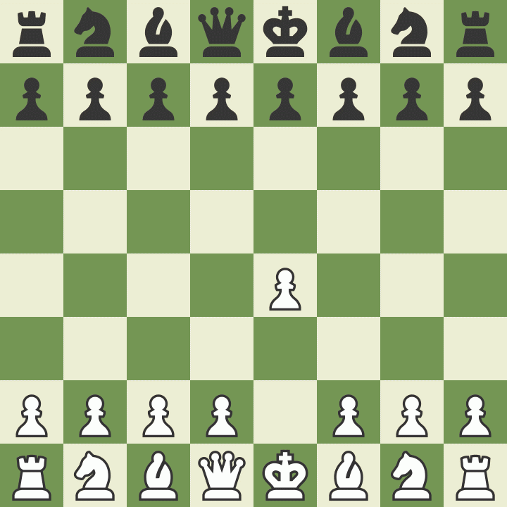

# ♟️ MyChessResNet-1900

[**English Version**](#english-version) | [**Русская версия**](#русская-версия)

---

<a name="english-version"></a>
## 🇬🇧 English Version

A PyTorch-powered deep learning chess AI featuring a **ResNet architecture** integrated with **Minimax search and Alpha-Beta pruning**. The model is trained on human games from Lichess to emulate realistic, positional human play at approximately ~1900 Elo level.

---
### ⚔️ AI in Action: Human-like Attacking Play
Here is a highlight from the test matches. **MyChessResNet-1900 (White)** plays a vicious King's Gambit against **Maia-1800 (Black)** and finishes with a beautiful checkmate!



### 🌟 About The Project

**MyChessResNet-1900** was created as an accessible, human-like AI chess engine. Unlike traditional brute-force engines (like Stockfish) that evaluate millions of moves per second, this engine relies on deep convolutional residual networks to evaluate board positions intuitively—mimicking how intermediate-to-advanced human players think.

- **Human-like Playstyle**: Trained on standard rated human games between 1700–2100 Elo.
- **Lightweight Architecture**: Designed to run efficiently even on CPU without requiring heavy CUDA hardware for inference.
- **Standard Protocol**: Fully compatible with the Universal Chess Interface (**UCI**), meaning it can be plugged into popular Chess GUIs (Arena, Banksia, Nibbler, Cutechess, etc.).

---

### 💡 Why Choose This Chess AI?

Unlike traditional brute-force engines like Stockfish that calculate millions of positions, or heavy neural networks like Leela Chess Zero (Lc0) that require powerful GPUs, this engine bridges the gap. It uses a lightweight PyTorch ResNet to mimic human intuition (~1900 Elo) and a classic Minimax algorithm as a blunder-protector. It is perfect for developers looking for a clean, understandable, and customizable hybrid chess AI in Python.

---

### ✨ Features

- **Hybrid Architecture**: ResNet (Deep Learning) + Minimax Search.
- **Human-like Play**: Trained on 1700-2100 Elo Lichess standard games.
- **Fully UCI Compatible**: Works out-of-the-box with Arena, Lichess, Cutechess, etc.
- **Beginner Friendly**: Well-documented Python code, easy to retrain on your own datasets.

---

### 🧠 Model Architecture & Features

1. **Neural Network (ResNet)**:
   - **Board Representation**: $18 \times 8 \times 8$ tensor (12 piece planes + 1 turn plane + 4 castling rights planes + 1 en passant plane).
   - **Backbone**: Initial 2D Convolution layer followed by **8 Residual Blocks** (128 channels each) with Batch Normalization and ReLU activations.
   - **Head**: Fully connected layers outputting move probability distributions across thousands of unique UCI moves.

2. **Decision Making & Tactical Safety**:
   - **Intuition Top-K Selection**: The neural network suggests the Top 10 candidate moves based on positional intuition.
   - **Blunder-Protector Minimax**: Minimax does not hunt for the mathematically best move — it only vetoes catastrophes. A candidate is rejected only when it drops the evaluation by more than `BLUNDER_THRESHOLD` (150 centipawns / 1.5 pawns) compared to the pre-move position score. Among the safe moves, the most human one (highest NN probability) is played.
   - **Self-Preservation Fallback**: If all Top-10 moves blunder (a neural network blind spot), the engine picks the least-loss move instead of hanging a piece.
   - **Piece-Square Tables**: `evaluate_board` adds classical PST values for every piece type, giving the search positional awareness — centralization, development and king safety.
   - **Iterative Deepening Minimax (up to Depth 3)**: Evaluates chosen candidate moves with Alpha-Beta pruning, quiescence search and strict node-based time management to prevent timeouts.
   - **MVV-LVA Heuristic**: Optimizes the search tree by forcing the engine to analyze the best captures first (Most Valuable Victim - Least Valuable Attacker).
   - **Opening Variety (first 15 moves)**: A weighted random pick among the top-3 safe moves (weights = NN probabilities) prevents deterministic "Groundhog Day" games.

---

### ⚔️ Benchmark & Comparison

The engine includes a comparison suite (`comparison/`) configured to run automated matches against **Maia-1800** (a state-of-the-art human prediction model based on Leela Chess Zero).

- **Opponent**: Maia-1800 (run via `lc0.exe` engine with 1-node limit).
- **Match Setup**: Multi-threaded automated battle managed via `arena.py`.

---

```markdown
### 🚀 Quick Start

#### Requirements
- Python 3.9+
- `torch`, `python-chess`, `numpy`

```bash
pip install torch python-chess numpy
```

#### Running the Engine via UCI

To launch the UCI engine directly:

```bash
python uci_engine.py
# or run the batch file on Windows
run_engine.bat
```

#### Playing in a GUI

You can add `uci_engine.py` (or `run_engine.bat`) as an External UCI Engine in any
Chess GUI such as Arena GUI, Cutechess, or Nibbler.

---

### 📁 Project Structure

```text
mychessai/
├── chess_resnet_model.pth    # Pre-trained model weights
├── uci_engine.py             # Main UCI Chess Engine (Minimax + ResNet)
├── move_to_id.npy            # Vocabulary mapping moves to IDs
├── run_engine.bat            # Windows startup script
├── filter_games.py           # PGN Dataset filtering script
├── prepare_data.py           # Feature extraction script (3D Tensors)
├── add-info.txt              # Advanced documentation & Colab training code
├── comparison/               # Arena bench testing suite against Maia-1800
│   ├── arena.py              # Automated match executor
│   ├── results.txt           # Battle logs and PGN records
│   └── maia-1800.pb.gz       # Maia weights & supporting executables
└── README.md
```

### 📖 Custom Training & Advanced Details

If you wish to train your own AI model, customize the dataset, or explore the
full training pipeline used on Google Colab, please read the `add-info.txt` file
included in this repository.

---

<a name="русская-версия"></a>
## 🇷🇺 Русская версия

Шахматный ИИ на базе глубокого обучения PyTorch, объединяющий **архитектуру ResNet** с **поиском Minimax и Alpha-Beta отсечением**. Модель обучена на человеческих партиях Lichess и воспроизводит реалистичный, позиционный стиль игры человека на уровне около ~1900 Elo.

---
### ⚔️ ИИ в действии: атакующая игра в человеческом стиле
Вот яркий момент из тестовых партий. **MyChessResNet-1900 (белые)** разыгрывает яростный королевский гамбит против **Maia-1800 (чёрные)** и завершает партию красивым матом!


### 🌟 О проекте

**MyChessResNet-1900** создан как доступный, «человекоподобный» шахматный ИИ-движок. В отличие от классических переборных движков (например, Stockfish), считающих миллионы вариантов в секунду, данный движок опирается на глубокие сверточные остаточные сети, интуитивно оценивая позицию на доске — подобно тому, как размышляют шахматисты среднего и продвинутого уровня.

- **Стиль игры человека**: Обучен на стандартных рейтинговых партиях людей с рейтингом 1700–2100 Elo.
- **Лёгкая архитектура**: Эффективно работает даже на CPU, не требуя мощного CUDA-оборудования для инференса.
- **Стандартный протокол**: Полностью совместим с протоколом UCI (Universal Chess Interface), что позволяет подключать его к популярным шахматным GUI (Arena, Banksia, Nibbler, Cutechess и др.).

---

### 💡 Почему стоит выбрать этот шахматный ИИ?

В отличие от классических переборных движков вроде Stockfish, считающих миллионы позиций, или тяжёлых нейросетей вроде Leela Chess Zero (Lc0), требующих мощных GPU, этот движок занимает золотую середину. Он использует лёгкий PyTorch ResNet для имитации человеческой интуиции (~1900 Elo) и классический алгоритм Minimax в качестве предохранителя от зевков. Идеален для разработчиков, ищущих чистый, понятный и настраиваемый гибридный шахматный ИИ на Python.

---

### ✨ Особенности

- **Гибридная архитектура**: ResNet (глубокое обучение) + поиск Minimax.
- **Человеческий стиль игры**: Обучен на партиях Lichess с рейтингом 1700–2100 Elo.
- **Полная совместимость с UCI**: Работает «из коробки» с Arena, Lichess, Cutechess и др.
- **Подходит новичкам**: Хорошо документированный Python-код, легко переобучить на своём датасете.

---

### 🧠 Архитектура модели и особенности

1. **Нейросеть (ResNet)**:
   - **Представление доски**: Тензор $18 \times 8 \times 8$ (12 слоёв фигур + 1 слой очереди хода + 4 слоя прав на рокировку + 1 слой взятия на проходе).
   - **Ядро**: Начальный слой 2D-свёртки, за которым следуют **8 остаточных блоков** (по 128 каналов) с Batch Normalization и активациями ReLU.
   - **Выходной слой**: Полносвязные слои, выдающие распределение вероятностей по тысячам уникальных UCI-ходов.

2. **Принятие решений и тактическая безопасность**:
   - **Интуитивный выбор Top-K**: Нейросеть предлагает 10 лучших кандидатов-ходов на основе позиционной интуиции.
   - **Предохранитель от зевков (Blunder-Protector Minimax)**: Minimax не ищет математически лучший ход — он лишь отсекает катастрофы. Ход отбрасывается только тогда, когда он роняет оценку более чем на `BLUNDER_THRESHOLD` (150 сантипешек / 1.5 пешки) по сравнению с оценкой позиции до хода. Среди безопасных ходов выбирается самый человеческий (с наивысшей вероятностью нейросети).
   - **Инстинкт самосохранения**: Если все 10 ходов из Топ-10 ведут к потере (слепое пятно нейросети), движок выбирает ход с наименьшими потерями вместо того, чтобы отдать фигуру.
   - **Таблицы позиционирования (Piece-Square Tables)**: `evaluate_board` добавляет классические значения PST для каждого типа фигур, придавая поиску позиционное понимание — централизацию, развитие и безопасность короля.
   - **Итеративное углубление Minimax (до глубины 3)**: Оценивает выбранные ходы-кандидаты с помощью Alpha-Beta отсечения, quiescence-поиска и строгого управления временем по количеству узлов, чтобы избежать таймаутов.
   - **Эвристика MVV-LVA**: Оптимизирует дерево поиска, заставляя движок в первую очередь анализировать лучшие взятия (Most Valuable Victim - Least Valuable Attacker).
   - **Вариативность дебюта (первые 15 ходов)**: Взвешенный случайный выбор среди топ-3 безопасных ходов (веса = вероятности нейросети) предотвращает детерминированные партии-«День сурка».

---

### ⚔️ Бенчмарк и сравнение

Движок включает набор для сравнения (`comparison/`), настроенный для автоматических матчей против **Maia-1800** (передовой модели предсказания человеческих ходов на базе Leela Chess Zero).

- **Соперник**: Maia-1800 (запускается через движок `lc0.exe` с ограничением в 1 ноду).
- **Настройка матчей**: Многопоточная автоматическая битва, управляемая через `arena.py`.

---

```markdown
### 🚀 Быстрый старт

#### Требования
- Python 3.9+
- `torch`, `python-chess`, `numpy`

```bash
pip install torch python-chess numpy
```

#### Запуск движка через UCI

Чтобы запустить UCI-движок напрямую:

```bash
python uci_engine.py
# или запустите batch-файл на Windows
run_engine.bat
```

#### Игра в GUI

Вы можете добавить `uci_engine.py` (или `run_engine.bat`) как внешний UCI-движок в
любой шахматный GUI, например Arena GUI, Cutechess или Nibbler.

---

### 📁 Структура проекта

```text
mychessai/
├── chess_resnet_model.pth    # Предобученные веса модели
├── uci_engine.py             # Основной UCI-движок (Minimax + ResNet)
├── move_to_id.npy            # Словарь соответствия ходов и ID
├── run_engine.bat            # Скрипт запуска для Windows
├── filter_games.py           # Скрипт фильтрации PGN-датасета
├── prepare_data.py           # Скрипт извлечения признаков (3D-тензоры)
├── add-info.txt              # Подробная документация и код обучения для Colab
├── comparison/               # Набор для сравнения с Maia-1800
│   ├── arena.py              # Автоматический исполнитель матчей
│   ├── results.txt           # Логи партий и записи PGN
│   └── maia-1800.pb.gz       # Веса Maia и вспомогательные исполняемые файлы
└── README.md
```

### 📖 Своё обучение и подробности

Если вы хотите обучить собственную модель ИИ, настроить датасет под себя или
изучить полный пайплайн обучения, использованный в Google Colab, ознакомьтесь с
файлом `add-info.txt`, включённым в этот репозиторий.